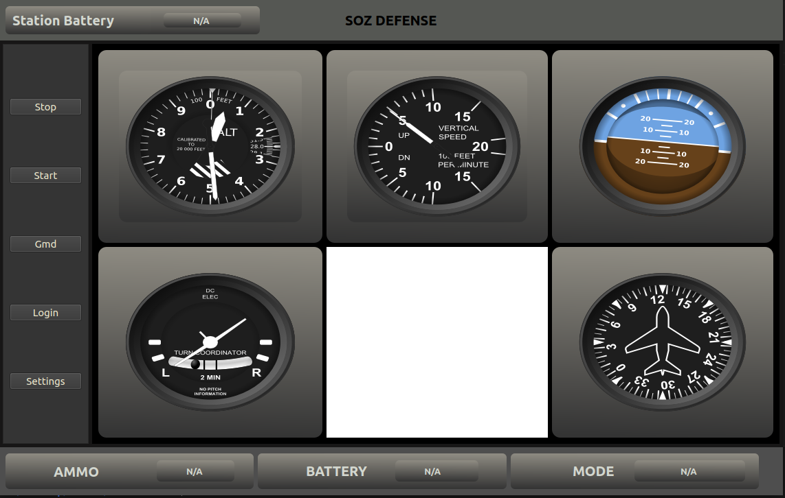
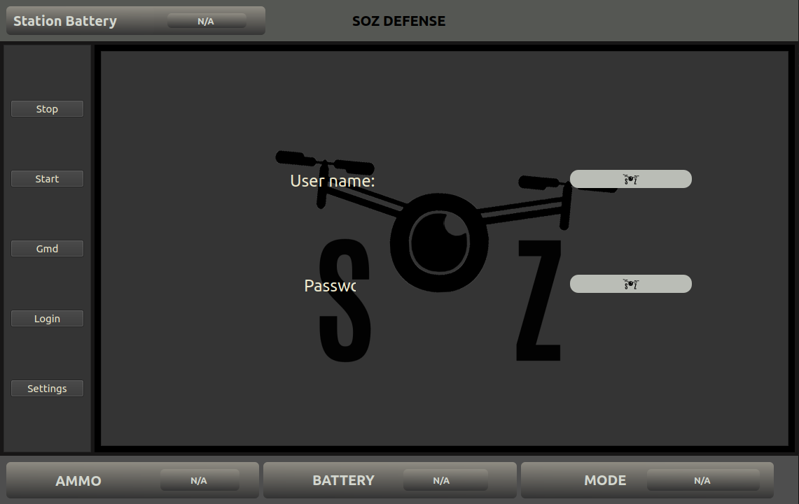
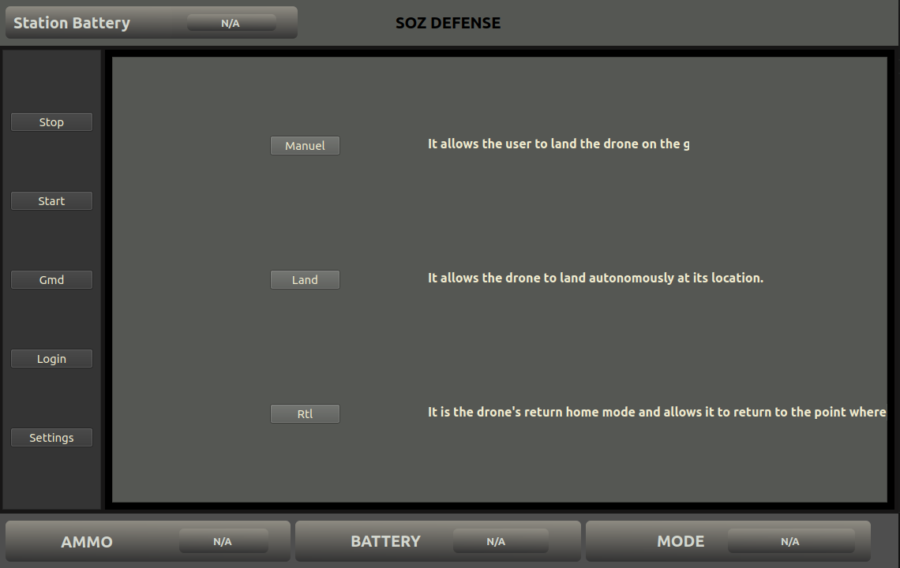
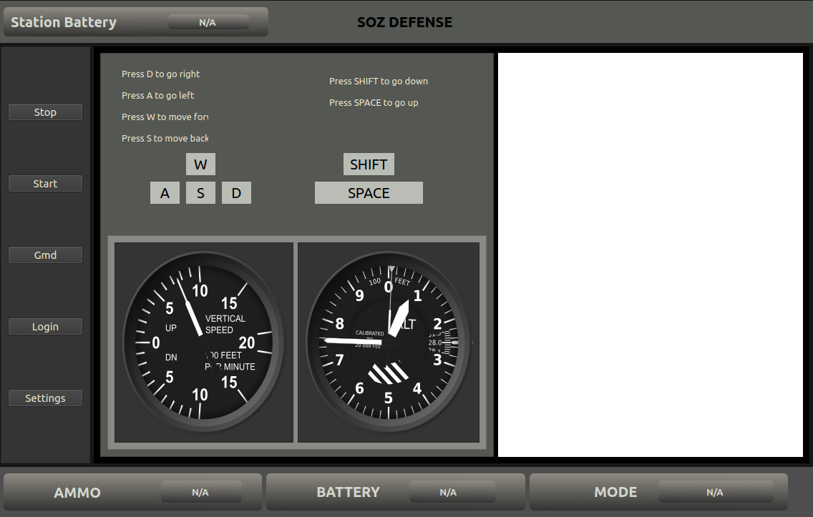
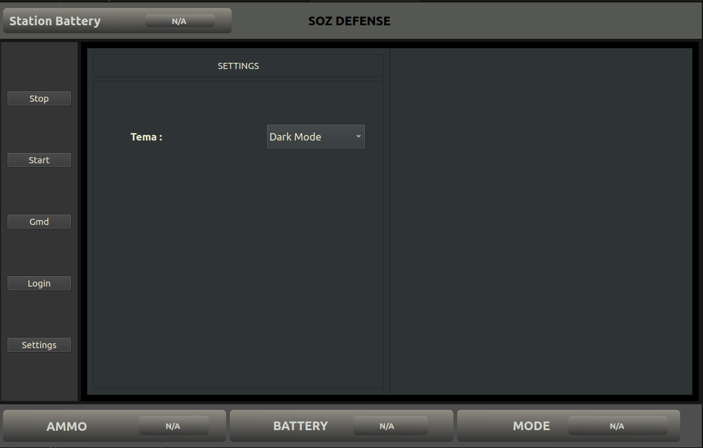

# UAV Interface

UAV Interface is a control and monitoring interface developed for Unmanned Aerial Vehicles (UAVs). This interface enables users to easily manage UAVs and monitor operational data in real-time.




## Table of Contents

- [Features](#features)
- [Installation](#installation)
- [Screenshots](#screenshots)
- [Usage](#usage)
- [Contact](#contact)

## Features

- Real-time flight data monitoring
- Landing options
- UAV status reports
- Emergency management

## Installation

To install İHAİnterface on your local machine, follow these steps:

1. **Clone the repository:**

    ```bash
    git clone https://github.com/kullaniciadi/IHAinterface.git
    ```

2. **Navigate to the project directory:**

    ```bash
    cd IHAinterface
    ```

3. **Install the required dependencies:**

    ```bash
    pip install -r requirements.txt
    ```

4. **Start the project:**

    ```bash
    python main.py
    ```
    
## Screenshots

Below are some screenshots of the İHAİnterface:

### Main Login Panel


### Flight Panel


### Landing Panel


### Manual Landing Panel


### Settings Panel


## Usage

To use İHAİnterface for controlling and monitoring your UAV, follow these steps:

1. **Start the interface:**

    ```bash
    python main.py
    ```

## Contact

For any questions or feedback, please reach out:

- **Email:** ozturktaylan266@gmail.com
- **GitHub:** [https://github.com/iamtaylan/IHAinterface](https://github.com/iamtaylan/IHAinterface)
